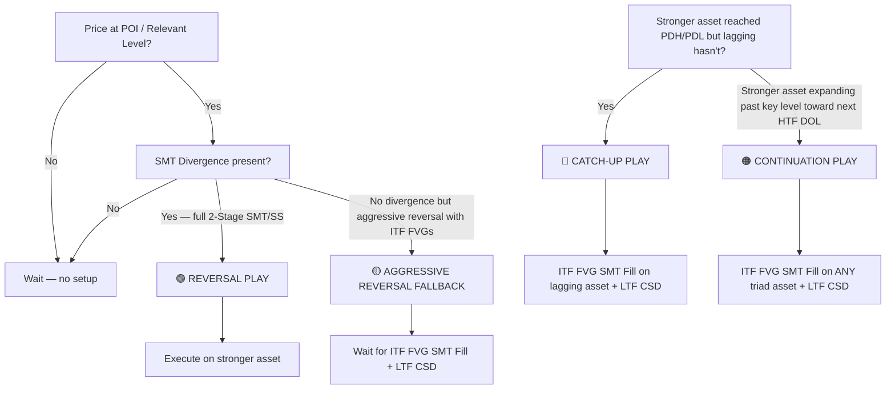

# GxT Daily Execution Playbook

A step-by-step guide for approaching each trading day — from pre-session bias formation through live execution and trade management.

---

## Phase 1 · Pre-Session Homework (Before 18:00 ET CME Open)

### Step 1 — Classify Yesterday's Day Type

Pull up the **Daily chart** and classify the previous session:

| Day Type | What It Looks Like | Bias It Produces |
|---|---|---|
| **Expansion / Reversal** | Large-range candle, strong directional close, one side's liquidity clearly swept | **Directional** — trade in the direction of the expansion/reversal |
| **Consolidation** | Tight range, wicks on both sides, body closes near middle of range | **Neutral** — wait for PDH/PDL sweep + Strength Switch before taking a side |

> [!IMPORTANT]
> This classification is the foundation of everything else. Get this wrong and every downstream decision is compromised.

### Step 2 — Mark Relevant Levels

On the **Daily → 4H → 1H → 30m** charts, mark:

- [ ] **PDH / PDL** (Previous Day High / Low)
- [ ] **PWH / PWL** (Previous Week High / Low)
- [ ] **18:00 Daily Open** price (this becomes your TP1 default)
- [ ] Any **unmitigated HTF FVGs** (4H, 1H) sitting within the previous day's range
- [ ] **ADR** (Average Daily Range) — note how much range was consumed yesterday vs. average

### Step 3 — Identify the POI (Point of Interest)

**If Directional Bias (Expansion/Reversal Day):**

```
Check for a 4H FVG within the 50% equilibrium range of the Previous Day
  └─ Found? → This is your POI (where you expect the daily wick to form)
  └─ Not found? → Check for a 1H FVG in the same zone
      └─ Found? → This is your POI
      └─ Not found? → Maintain directional bias, but wait for price
                       to create and manipulate a new Relevant Level
```

**If Neutral Bias (Consolidation Day):**
- No pre-set POI. You are waiting for price to sweep PDH or PDL first.
- The sweep + 2-Stage SMT/SS will create your POI in real time.

### Step 4 — Set Targets

| Target | Level | When to Use |
|---|---|---|
| **Primary TP** | Next **eligible level** (HTF swing, PDH/PDL, or PWH/PWL) | Default — the nearest high-probability structural magnet in the direction of your bias; HTF FVGs are not TP candidates |
| **Daily Open TP** | 18:00 Daily Open | Only on **reversal days with a large wick** — when ADR is nearly consumed and the reversal fires late, price is expected to pull back to cap the daily wick |

> [!NOTE]
> The target is NOT always the 18:00 Daily Open. Your default target is the next Relevant Level. The Daily Open is a special-case target reserved for large-wick reversal days where the daily range is already stretched.

---

## Phase 2 · Session Open & Monitoring (18:00 ET onward)

### Step 5 — Watch for Price to Reach the POI

Monitor the **ITF charts (4H / 90m / 1H / 30m)** for price to trade into your pre-marked POI or Relevant Level.

**What you're watching for:**
- Price trading into or through the FVG / Relevant Level
- Which triad asset (ES, NQ, YM) reaches the level first vs. which lags

> [!TIP]
> Don't force a trade before price reaches a POI. Patience here is the edge. Your only job during this phase is observation.

### Step 6 — Check for SMT Divergence at the POI (Stage 1)

When price reaches the POI, check all 3 triad assets:

```
Asset A sweeps the level / makes a new extreme
Asset B fails to sweep / stalls / makes a higher low (bullish) or lower high (bearish)
─────────────────────────────────────────────────────
✅ SMT Divergence present → Move to Stage 2
❌ All 3 assets make identical moves → No divergence, stay patient
```

**Synergy Rule:** Only 2 of 3 triad assets need to show divergence. If the 3rd asset is actively expanding in the opposite direction, the setup is **not invalid but lower probability** — size accordingly and tighten your conviction requirements.

### Step 7 — After Stage 1 SMT, Watch for Stage 2 Confirmation

Once Stage 1 SMT divergence is identified at the POI, you are now watching for **Stage 2** — which can take two forms:

1. **2-Stage SMT**: A second SMT on the **IMT charts (15m / 30m / 1H / 90m)** where the stronger and weaker assets **switch strength** — the previously lagging asset now leads, creating a second divergence that confirms the reversal.
2. **2-Stage PSP (Polarized Strength Profile)**: A **Strength Switch PSP** on the ITF candle closes where the asset that swept closes in the reversal direction while its correlated pair closes in the trend direction — confirming the strength rotation.

> [!IMPORTANT]
> The key signal in both cases is the **strength switch** — the stronger asset must switch roles with the weaker asset. This is what confirms institutional rotation, not just a one-off divergence.

---

## Phase 3 · Execution Decision Tree

### Step 8 — Determine Which Play Type Applies



---

### Play A · Reversal Play (Primary Setup)

> The highest-conviction trade. Requires the full 2-Stage SMT confirmation.

**Stage 1 — HTF SMT Divergence** *(already confirmed in Step 6)*

**Stage 2 — IMT Strength Switch (SMT or PSP):**

1. After Stage 1, monitor the **IMT charts (15m / 30m / 1H / 90m)** for a second divergence
2. Watch for the **strength switch** — the previously stronger asset stalls or reverses while the previously weaker asset drives through, creating a **second SMT** where roles reverse
   - Alternatively, look for a **Strength Switch PSP** — opposite-polarity ITF candle closes confirming the rotation
3. Once the strength switch is confirmed, drop to **LTF (5m / 3m / 1m)** for the entry trigger
4. Look for the **C1 → C2 (→ C3)** candle sequence:
   - **C1 (Protraction Candle)**: First candle that sweeps or trades into the Relevant Level
   - **C2 (Reversal Candle)**: Sweeps C1's extreme, then **body-closes back inside C1's range**
     - ✅ Valid C2 closure → **Confirmed immediately** (no wick-size delay)
   - **C3 (Confirmation Candle)**: Only needed if C2 body-closes **outside** C1's range. C3 must body-close past C2's body in the reversal direction
5. Identify the **CISD (Change in State of Delivery)** on any triad asset — prioritize the one closest to its open DOL
6. **Strength Switch is locked** when any triad asset prints the LTF CISD

**Entry:** The candle **immediately following** the confirmed CSD closure.

**Execute on:** The **stronger asset** (cleanest V-shape displacement from the sweep).

**Stop-Loss:** At the **absolute swing extreme** (wick) of the sweep candle at the POI.

**Target:** The next **Relevant Level** (PDH/PDL, PWH/PWL, or unmitigated HTF structure). If it's a large-wick reversal day with ADR nearly consumed, target the **18:00 Daily Open** instead.

---

### Play B · Catch-Up Play

> When the stronger asset has continued past the draw on liquidity or is consolidating at it, but the lagging asset hasn't reached its equivalent level.

**Conditions:**
- Stronger asset has either **continued past its DOL** (PDH/PDL) OR is **consolidating at it**
- Lagging asset has NOT reached its equivalent level
- The stronger asset must be doing one of the two above — if it has reversed away from the DOL, this play does NOT apply

**Trigger:**
1. Monitor the **lagging asset** for an **ITF FVG (30m / 1H / 90m)** to form
2. Wait for **SMT Fill** — 1 or 2 (but NOT all 3) triad assets enter their respective ITF FVGs
3. Watch for a **LTF CSD (3m / 5m)** on the lagging asset with **displacement** (must leave a new LTF FVG or show an exceptionally strong body close)

**Entry:** Next candle after CSD confirmation on the lagging asset.

**Target:** The lagging asset's own equivalent PDH/PDL level.

> [!WARNING]
> **Immediate invalidation** if the stronger asset prints a counter-trend LTF CSD. This kills the catch-up thesis — the stronger asset is reversing, and you cannot expect the lagging one to continue.

---

### Play C · Continuation Play

> When price has broken past the key level and is expanding toward the next HTF Draw on Liquidity.

**Conditions:**
- Price (stronger asset) has expanded past PDH/PDL toward the next HTF DOL
- You're looking to add to the move or enter fresh

**Trigger:**
1. Wait for an **ITF FVG (30m / 1H / 90m)** to form during the expansion
2. Watch for **SMT Fill** on **ANY** triad asset (not just the one you're trading)
3. Wait for a **LTF CSD (3m / 5m)** with displacement

**Asset Selection:**
- Trade the **stronger asset** if it has open HTF DOLs within ADR reach
- Otherwise trade the **lagging asset** toward its own PDH/PDL

---

### Aggressive Reversal Fallback (No 2-Stage SMT)

> When price reverses aggressively from a POI leaving new ITF FVGs, but without a clean 2-Stage SMT.

**Conditions:**
- Price reversed hard from a POI
- New ITF FVGs (30m / 1H / 90m) were created during the reversal move
- No clean 2-Stage SMT/SS completed

**Trigger:**
1. Transition to **continuation bias** in the reversal direction
2. Wait for the **ITF FVG SMT Fill** + **LTF CSD (3m / 5m)** with displacement

> [!CAUTION]
> This is lower conviction than a full reversal play. Size accordingly.

---

## Phase 4 · Trade Management

### Step 9 — Manage the Position

| Milestone | Action |
|---|---|
| **Entry** | SL at absolute swing extreme (wick) of sweep candle |
| **2R reached** OR price breaks first counter-trend LTF swing point (LTF MSS) | Move SL to **break-even** |
| **TP1 hit** (18:00 Daily Open) | Take partials or full close |
| **TP2 hit** (Opposite PDH/PDL) | Close remaining position |

### Step 10 — Validate the Expansion Leg

After entry, monitor the **50% Equilibrium Rule**:

- Measure the **expansion leg**: Start = absolute extreme (wick) of sweep candle → End = highest high / lowest low before a 3-candle fractal confirms
- Price must **NOT close past the 50% retracement** of this expansion leg on your execution timeframe
- Lower ITF FVGs (30m) may be inversed during retracement as long as the higher ITF FVG (1H) and 50% equilibrium hold

> [!NOTE]
> **Exception:** Both the 50% rule and FVG boundaries can be bypassed if confirmed via SMT Divergence + Strength Switch. The cross-asset signal overrides single-chart structure.

---

## Phase 5 · Post-Session Review

### Step 11 — Journal the Day

- What day type was it? Did your pre-session classification hold?
- Did price reach your POI? How did it react?
- Which play type triggered (if any)?
- Did the SMT divergence / strength switch sequence fire cleanly?
- Were there setups you missed? Why?
- Did risk management rules hold? Any break-even triggers?

---

## Quick Reference — The "Am I Ready to Click?" Checklist

Before every execution, confirm:

- [ ] **Bias is set** — day type classified, directional or neutral determined
- [ ] **POI identified** — price is at or has swept a Relevant Level
- [ ] **SMT Divergence confirmed** — at least 2 of 3 triad assets showing divergence
- [ ] **Correct play type selected** — Reversal / Catch-Up / Continuation / Fallback
- [ ] **LTF trigger fired** — C2/C3 closure (Reversal) OR CSD with displacement (Catch-Up / Continuation)
- [ ] **Strength Switch locked** — CISD on at least one triad asset
- [ ] **Right asset selected** — stronger asset for reversals, lagging for catch-ups
- [ ] **SL placed** — at absolute wick extreme of sweep candle
- [ ] **Target set** — next Relevant Level (PDH/PDL, PWH/PWL) or 18:00 Daily Open on large-wick reversal days

> [!IMPORTANT]
> **What you are NOT allowed to do:**
> - Reverse a lagging asset while the stronger asset consolidates at highs/lows without a full 2-Stage SMT/SS
> - Use a simple LTF CSD alone as a reversal confirmation (that's only valid for continuation/catch-up plays)
> - Enter before the CSD/C2 closure is confirmed — no anticipation trades
